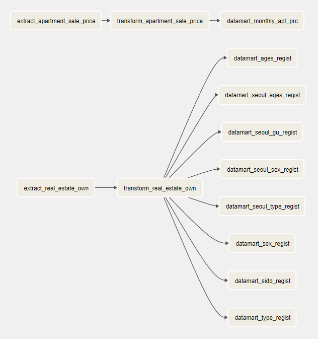
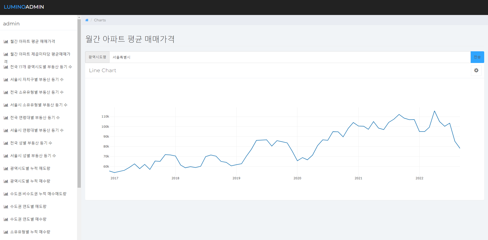

# 부동산 공공데이터를 이용한 거래분석

### 1. 프로젝트 주제
- 국가기관의 공공데이터 제공이 가속화되면서 부동산 및 토지에 대한 가격과 거래량 중심의 분석이 많이 있었지만 매수인에 대한 정보와 같은 민감한 개인정보로 활용할 수 있는 데이터가 제한적인 상황이었음
- 하지만 법원 등기정보광장에서 다양한 등기 정보를 새로운 공공데이터 api로 제공하고 있어 이를 통한 거래분석이 가능해짐.
- 이에 따라 부동산 거래 현황을 지역, 성별, 연령대, 소유유형별로 분석하기 위해 필요한 데이터 파이프라인을 구축하고 데이터 제공을 위한 프로덕트를 개발

---

### 2. 데이터 출처 및 수집방법

- **대한민국 법원 등기정보광장**
    - 부동산 소유권 취득현황(지역, 소유자별)
    - 소유권이전등기(매매) 신청 매수인 현황(주소지별)
    - 소유권이전등기(매매) 신청 매수인 현황(내국인, 외국인, 법인 등)
    - 소유권이전등기(매매) 신청 매수인 현황(남/여, 연령별)
    - 소유권이전등기(매매) 신청 매수인 현황(외국인 국적별)

- **공공데이터 API**
    - 국토교통부 아파트 매매 실거래 상세 자료
    - 행정안전부_행정표준코드_법정동코드

| 데이터 종류 | 소스 데이터 형태 | 수집방법 | 수집 후 데이터 형태 |
|-----------|--------|--------|--------|
| 부동산 소유권 취득현황(지역, 소유자별) | JSON | 웹 크롤링 | JSON |
| 소유권이전등기(매매) 신청 매수인 현황(주소지별)| JSON | API 호출 | JSON |
| 소유권이전등기(매매) 신청 매수인 현황(내국인, 외국인, 법인 등)| JSON | API 호출 | JSON |
| 소유권이전등기(매매) 신청 매수인 현황(남/여, 연령별)| JSON | API 호출 | JSON |
| 소유권이전등기(매매) 신청 매수인 현황(외국인 국적별)| JSON | API 호출 | JSON |
| 국토교통부 아파트 매매 실거래 상세 자료 | XML | API 호출 | CSV |
| 행정안전부_행정표준코드_법정동코드 | XML | API 호출 | CSV |

---

### 3. 수행 도구

#### 개발환경

#### Data Lake

#### Data Warehouse, Data Mart

#### Data Processing

#### Scheduler (Batch)

#### Rest API 서버

#### 프론트엔드 서버

#### BI 시각화

#### 버전관리

#### 협업도구
**[Trello 주소](https://trello.com/b/dSDB5GjG/deproject)**

---

### 4. DW, DM 모델링

**[Data Warehouse](https://www.erdcloud.com/d/vQzBMWixkPMYYCjD2)**

**[Data Mart](https://www.erdcloud.com/d/WG6v3fnyo7inEToCy)**

---

### 5. 데이터 파이프라인

**AirFlow 일별 배치 스케쥴 Graph**

**AirFlow 월별 배치 스케쥴 Graph**

---

### 6. 데이터 분석

1. **전국 부동산 등기현황**
    - 전국 광역시도별 등기 현황
    - 서울특별시 자치구별 등기 현황
2. **부동산 소유현황**
    - 내국인/외국인/법인 등 소유유형별 소유현황
    - 연령대별 소유현황
    - 남/여별 소유현황
3. **심층 : 부동산 거래분석(매매를 위주로)**
    - 주소지별 거래분석
    - 매도량, 매수량 분석
    - 아파트 매매가격 동향 분석
    - 소유유형별 거래분석
    - 연령대별 거래분석
    - 남/여별 거래분석
    - 외국인 국적별 거래분석

---

### 7. 데이터 프로덕트

#### [REST API 서버](https://real-estate-analysis.cf/)

#### [프론트엔드 서버](https://junmumu.github.io/real-estate-transaction-chart/login.html)
